# Lab P4 — BluePrints en Tiempo Real (Sockets & STOMP)

> **Repositorio:** `DECSIS-ECI/Lab_P4_BluePrints_RealTime-Sokets`  
> **Front:** React + Vite (Canvas, CRUD, y selector de tecnología RT)  
> **Backends guía (elige uno o compáralos):**
> - **Socket.IO (Node.js):** https://github.com/DECSIS-ECI/example-backend-socketio-node-/blob/main/README.md
> - **STOMP (Spring Boot):** https://github.com/DECSIS-ECI/example-backend-stopm/tree/main

## 🎯 Objetivo del laboratorio
Implementar **colaboración en tiempo real** para el caso de BluePrints. El Front consume la API CRUD de la Parte 3 (o equivalente) y habilita tiempo real usando **Socket.IO** o **STOMP**, para que múltiples clientes dibujen el mismo plano de forma simultánea.

Al finalizar, el equipo debe:
1. Integrar el Front con su **API CRUD** (listar/crear/actualizar/eliminar planos, y total de puntos por autor).
2. Conectar el Front a un backend de **tiempo real** (Socket.IO **o** STOMP) siguiendo los repos guía.
3. Demostrar **colaboración en vivo** (dos pestañas navegando el mismo plano).

---

## 🧩 Alcance y criterios funcionales
- **CRUD** (REST):
  - `GET /api/blueprints?author=:author` → lista por autor (incluye total de puntos).
  - `GET /api/blueprints/:author/:name` → puntos del plano.
  - `POST /api/blueprints` → crear.
  - `PUT /api/blueprints/:author/:name` → actualizar.
  - `DELETE /api/blueprints/:author/:name` → eliminar.
- **Tiempo real (RT)** (elige uno):
  - **Socket.IO** (rooms): `join-room`, `draw-event` → broadcast `blueprint-update`.
  - **STOMP** (topics): `@MessageMapping("/draw")` → `convertAndSend(/topic/blueprints.{author}.{name})`.
- **UI**:
  - Canvas con **dibujo por clic** (incremental).
  - Panel del autor: **tabla** de planos y **total de puntos** (`reduce`).
  - Barra de acciones: **Create / Save/Update / Delete** y **selector de tecnología** (None / Socket.IO / STOMP).
- **DX/Calidad**: código limpio, manejo de errores, README de equipo.

---

## 🏗️ Arquitectura (visión rápida)

```
React (Vite)
 ├─ HTTP (REST CRUD + estado inicial) ───────────────> Tu API (P3 / propia)
 └─ Tiempo Real (elige uno):
     ├─ Socket.IO: join-room / draw-event ──────────> Socket.IO Server (Node)
     └─ STOMP: /app/draw -> /topic/blueprints.* ────> Spring WebSocket/STOMP
```

**Convenciones recomendadas**  
- **Plano como canal/sala**: `blueprints.{author}.{name}`  
- **Payload de punto**: `{ x, y }`

---

## 📦 Repos guía (clona/consulta)
- **Socket.IO (Node.js)**: https://github.com/DECSIS-ECI/example-backend-socketio-node-/blob/main/README.md  
  - *Uso típico en el cliente:* `io(VITE_IO_BASE, { transports: ['websocket'] })`, `join-room`, `draw-event`, `blueprint-update`.
- **STOMP (Spring Boot)**: https://github.com/DECSIS-ECI/example-backend-stopm/tree/main  
  - *Uso típico en el cliente:* `@stomp/stompjs` → `client.publish('/app/draw', body)`; suscripción a `/topic/blueprints.{author}.{name}`.

---

## ⚙️ Variables de entorno (Front)
Crea `.env.local` en la raíz del proyecto **Front**:
```bash
# REST (tu backend CRUD)
VITE_API_BASE=http://localhost:8080

# Tiempo real: apunta a uno u otro según el backend que uses
VITE_IO_BASE=http://localhost:3001     # si usas Socket.IO (Node)
VITE_STOMP_BASE=http://localhost:8080  # si usas STOMP (Spring)
```
En la UI, selecciona la tecnología en el **selector RT**.

---

## 🚀 Puesta en marcha

### 1) Backend RT (elige uno)

**Opción A — Socket.IO (Node.js)**  
Sigue el README del repo guía:  
https://github.com/DECSIS-ECI/example-backend-socketio-node-/blob/main/README.md
```bash
npm i
npm run dev
# expone: http://localhost:3001
# prueba rápida del estado inicial:
curl http://localhost:3001/api/blueprints/juan/plano-1
```

**Opción B — STOMP (Spring Boot)**  
Sigue el repo guía:  
https://github.com/DECSIS-ECI/example-backend-stopm/tree/main
```bash
./mvnw spring-boot:run
# expone: http://localhost:8080
# endpoint WS (ej.): /ws-blueprints
```

### 2) Front (este repo)
```bash
npm i
npm run dev
# http://localhost:5173
```
En la interfaz: selecciona **Socket.IO** o **STOMP**, define `author` y `name`, abre **dos pestañas** y dibuja en el canvas (clics).

---

## 🔌 Protocolos de Tiempo Real (detalle mínimo)

### A) Socket.IO
- **Unirse a sala**
  ```js
  socket.emit('join-room', `blueprints.${author}.${name}`)
  ```
- **Enviar punto**
  ```js
  socket.emit('draw-event', { room, author, name, point: { x, y } })
  ```
- **Recibir actualización**
  ```js
  socket.on('blueprint-update', (upd) => { /* append points y repintar */ })
  ```

### B) STOMP
- **Publicar punto**
  ```js
  client.publish({ destination: '/app/draw', body: JSON.stringify({ author, name, point }) })
  ```
- **Suscribirse a tópico**
  ```js
  client.subscribe(`/topic/blueprints.${author}.${name}`, (msg) => { /* append points y repintar */ })
  ```

---

## 🧪 Casos de prueba mínimos
- **Estado inicial**: al seleccionar plano, el canvas carga puntos (`GET /api/blueprints/:author/:name`).  
- **Dibujo local**: clic en canvas agrega puntos y redibuja.  
- **RT multi-pestaña**: con 2 pestañas, los puntos se **replican** casi en tiempo real.  
- **CRUD**: Create/Save/Delete funcionan y refrescan la lista y el **Total** del autor.

---

## 📊 Entregables del equipo
1. Código del Front integrado con **CRUD** y **RT** (Socket.IO o STOMP).  
2. **Video corto** (≤ 90s) mostrando colaboración en vivo y operaciones CRUD.  
3. **README del equipo**: setup, endpoints usados, decisiones (rooms/tópicos), y (opcional) breve comparativa Socket.IO vs STOMP.

---

## 🧮 Rúbrica sugerida
- **Funcionalidad (40%)**: RT estable (join/broadcast), aislamiento por plano, CRUD operativo.  
- **Calidad técnica (30%)**: estructura limpia, manejo de errores, documentación clara.  
- **Observabilidad/DX (15%)**: logs útiles (conexión, eventos), health checks básicos.  
- **Análisis (15%)**: hallazgos (latencia/reconexión) y, si aplica, pros/cons Socket.IO vs STOMP.

---

## 🩺 Troubleshooting
- **Pantalla en blanco (Front)**: revisa consola; confirma `@vitejs/plugin-react` instalado y que `AppP4.jsx` esté en `src/`.  
- **No hay broadcast**: ambas pestañas deben hacer `join-room` al **mismo** plano (Socket.IO) o suscribirse al **mismo tópico** (STOMP).  
- **CORS**: en dev permite `http://localhost:5173`; en prod, **restringe orígenes**.  
- **Socket.IO no conecta**: fuerza transporte WebSocket `{ transports: ['websocket'] }`.  
- **STOMP no recibe**: verifica `brokerURL`/`webSocketFactory` y los prefijos `/app` y `/topic` en Spring.

---

## 🔐 Seguridad (mínimos)
- Validación de payloads (p. ej., zod/joi).  
- Restricción de orígenes en prod.  
- Opcional: **JWT** + autorización por plano/sala.

---

## 📸 Evidencias

> Las capturas están en la carpeta [`images/`](images/).

### Punto 1 — CRUD completo (REST)

Se agregaron al backend los endpoints que faltaban para tener el CRUD completo:

| Método | Endpoint | Descripción |
|---|---|---|
| `GET` | `/api/v1/blueprints/{author}` | Planos de un autor |
| `GET` | `/api/v1/blueprints/{author}/{name}` | Un plano con sus puntos |
| `POST` | `/api/v1/blueprints` | Crear plano |
| `PUT` | `/api/v1/blueprints/{author}/{name}` | **Nuevo:** actualizar (reemplaza los puntos) |
| `DELETE` | `/api/v1/blueprints/{author}/{name}` | **Nuevo:** eliminar plano |

Todos los endpoints exigen un JWT (`POST /auth/login`).

**1.1 Endpoints disponibles en Swagger**

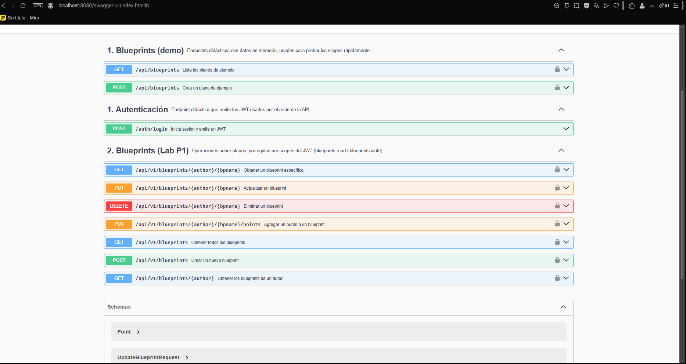

**1.2 Crear un plano — `POST` → 201**

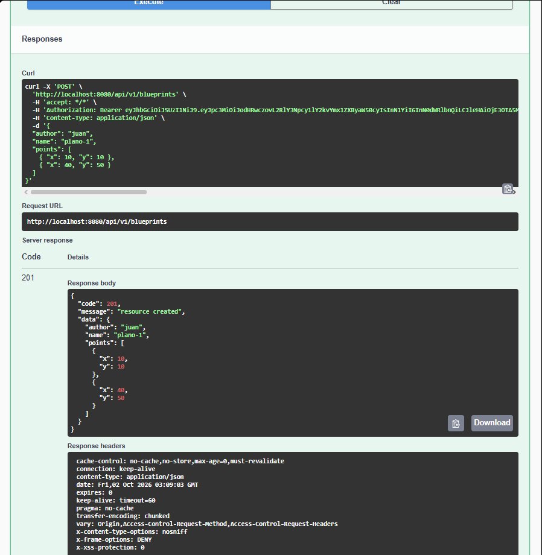

**1.3 Actualizar el plano — `PUT` → 200**

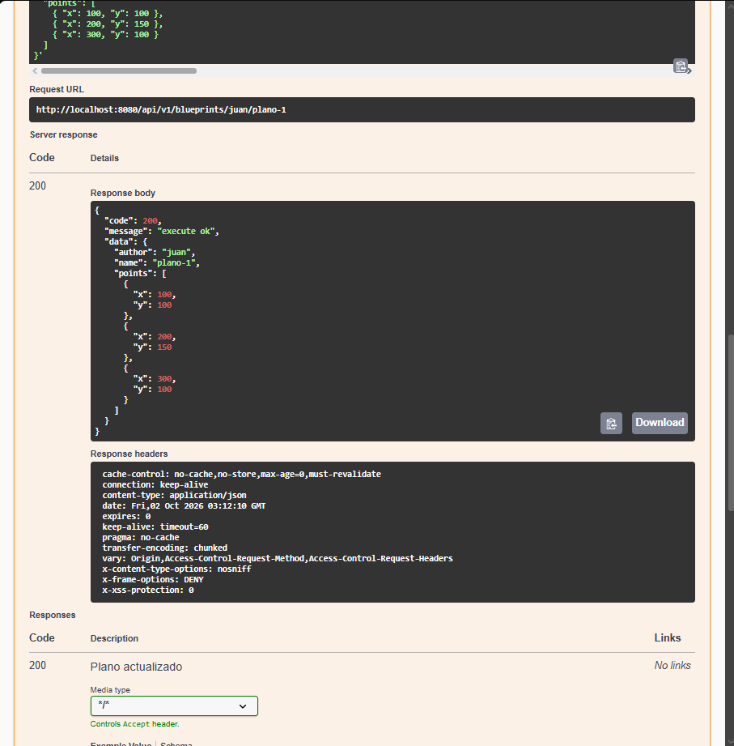

**1.4 Consultar los planos del autor — `GET` → 200**

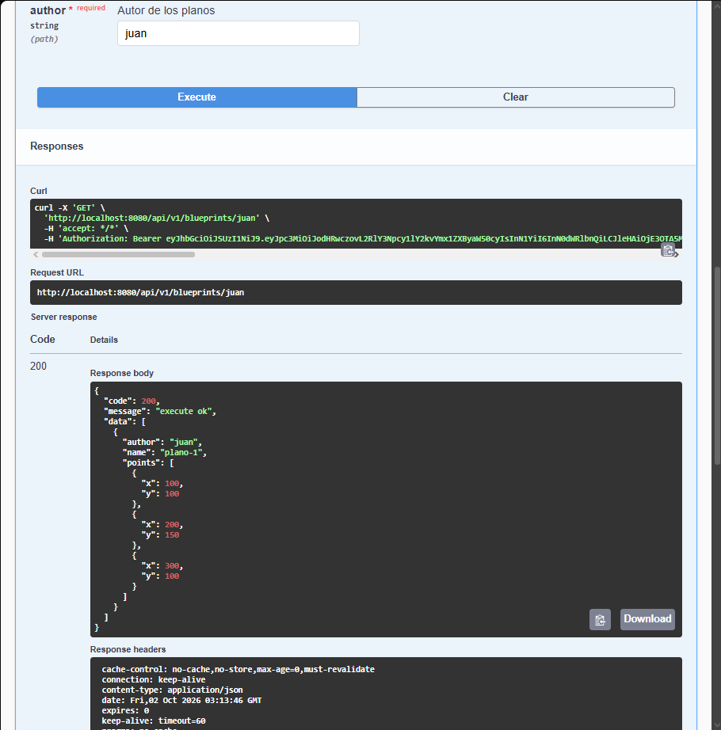

**1.5 Eliminar el plano — `DELETE` → 200**

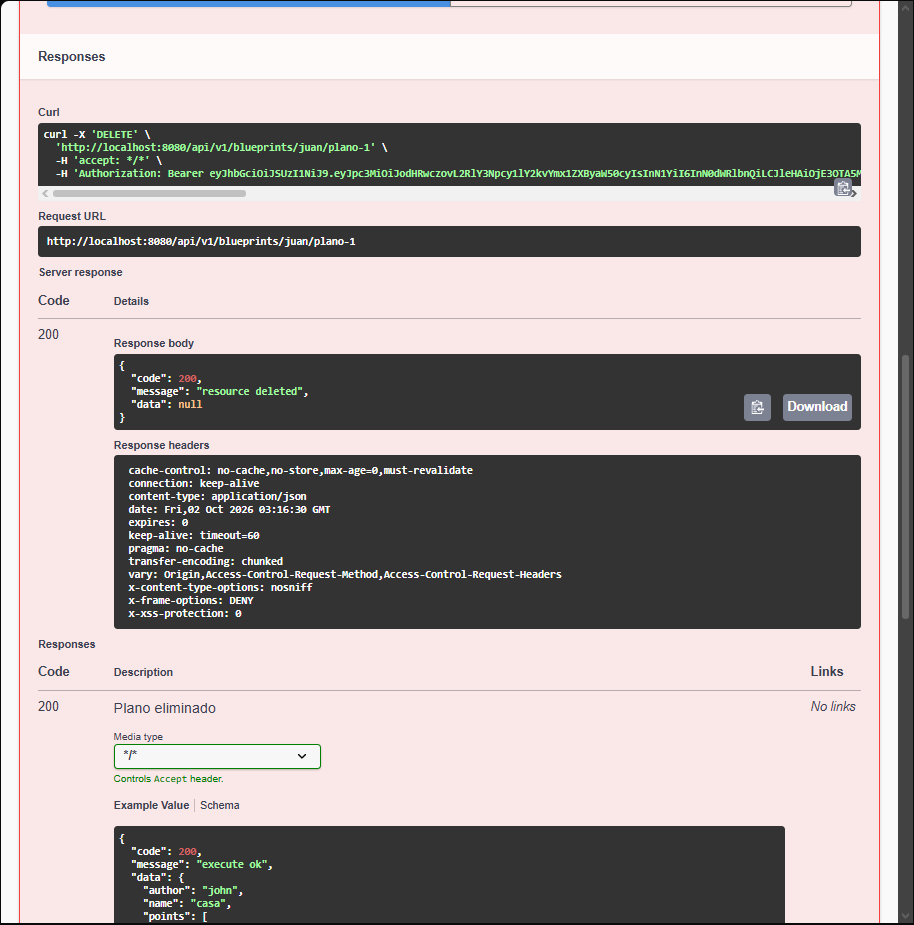

**1.6 Consultar el plano eliminado — `GET` → 404**

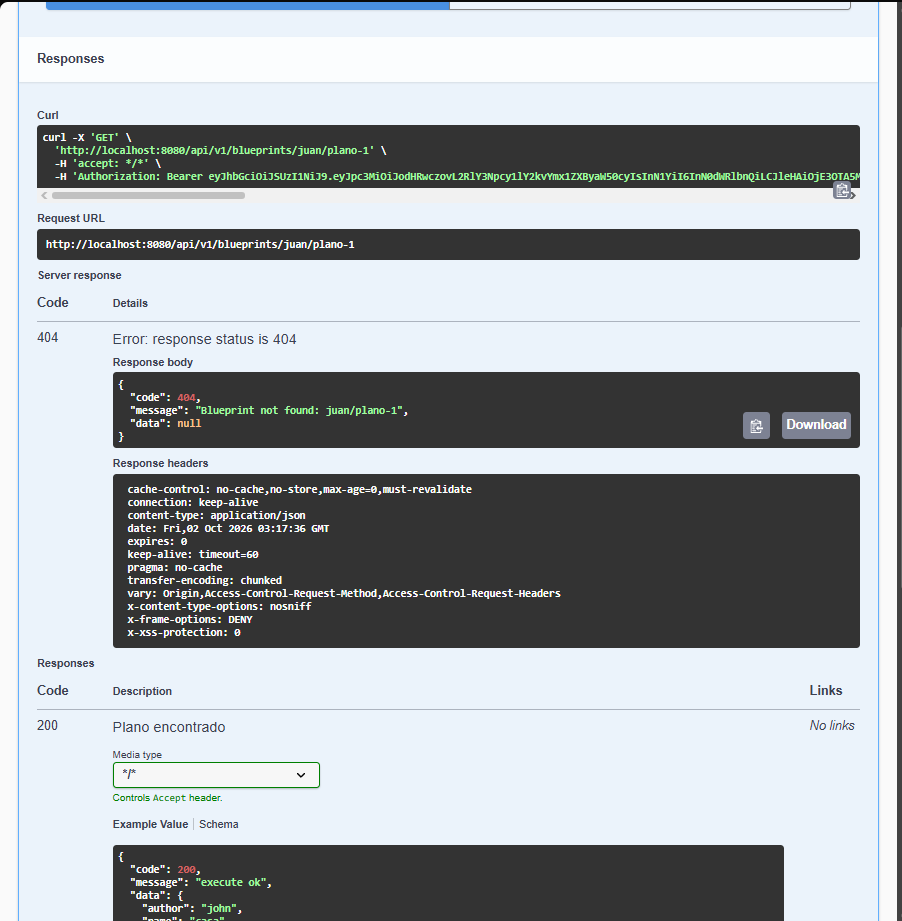

### Punto 2 — Tiempo real con STOMP (backend)

Se eligió **STOMP (Spring Boot)** y se integró en el mismo backend de la API (puerto 8080),
para que cada punto dibujado en tiempo real también quede **guardado en PostgreSQL**.

| Elemento | Valor |
|---|---|
| Endpoint WebSocket | `ws://localhost:8080/ws-blueprints` |
| Cliente → servidor | `SEND /app/draw` con `{ "author", "name", "point": { "x", "y" } }` |
| Servidor → clientes | `/topic/blueprints.{author}.{name}` con `{ "author", "name", "points": [...] }` |
| Errores (solo al emisor) | `/user/queue/errors` |
| Autenticación | Header `Authorization: Bearer <JWT>` en el frame `CONNECT` |
| Health check | `GET /actuator/health` |

**Decisiones de diseño**

- **Un tópico por plano** (`blueprints.{author}.{name}`): los clientes de un plano no reciben los puntos de otro (aislamiento).
- **El servidor guarda el punto y difunde el estado completo** del plano (todos los puntos), no solo el último. Así, cualquier cliente que se conecte tarde o pierda un mensaje queda sincronizado con el siguiente.
- **JWT en el `CONNECT`**: se reutiliza el mismo token de la API REST. Sin token válido la conexión se rechaza, así nadie puede escribir en la base sin iniciar sesión.
- **Validación del payload**: `author`, `name` y `point` son obligatorios y las coordenadas deben estar en `0..10000`. Si algo es inválido, el error se le envía solo al cliente que lo mandó.
- **Logs `[RT]`** de conexión, suscripción, dibujo, desconexión y rechazos, para observabilidad.

Archivos: [`src/main/java/co/edu/eci/blueprints/realtime/`](src/main/java/co/edu/eci/blueprints/realtime/).

**2.1 Health check — `GET /actuator/health` → `UP`**

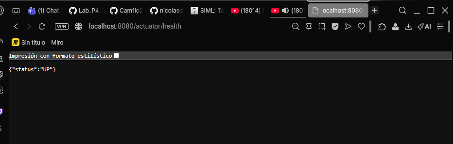

**2.2 Pruebas automáticas del tiempo real (`mvn test`)**

La prueba `BlueprintRealtimeTest` conecta tres clientes STOMP reales. Verifica que el punto llegue a los dos clientes del mismo plano, que **no** llegue al cliente suscrito a otro plano y que quede guardado. También verifica que **sin token no se pueda conectar**.

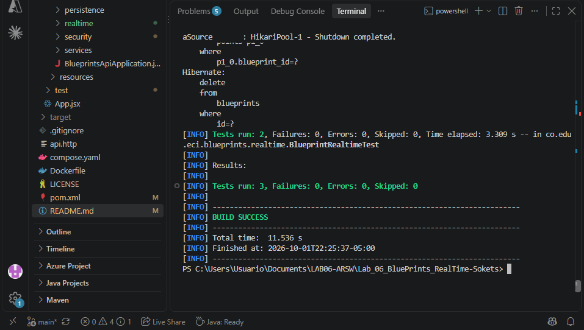

**2.3 Logs de tiempo real**

Conexión, suscripción a tópicos, dibujo de un punto, desconexión y rechazo de un cliente sin token:

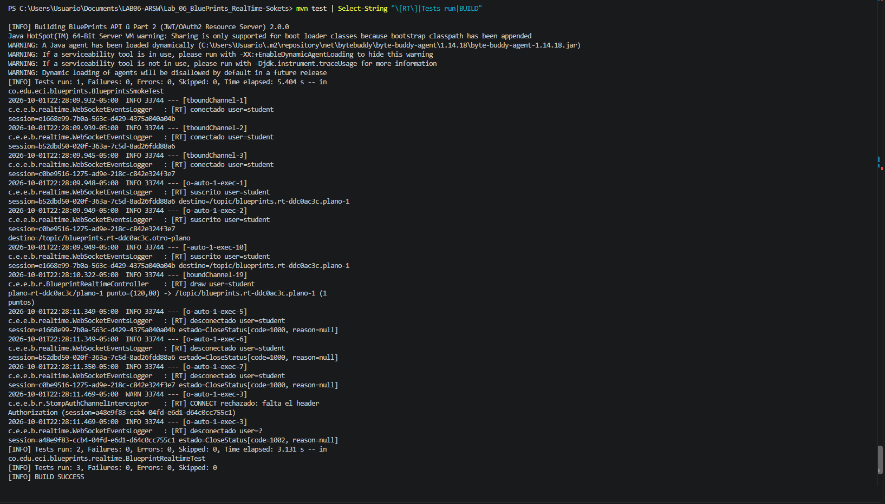

### Punto 3 — Front con CRUD y tiempo real

El front es el cliente React del **Lab P3** (React + Vite + Redux Toolkit + Axios con JWT), extendido para el Lab 06
en la rama `lab06-tiempo-real`. Consume esta API en `http://localhost:8080`.

**Qué se agregó al front**

| Requisito | Implementación |
|---|---|
| Canvas con dibujo por clic | `BlueprintCanvas` recibe `onPointClick` y escala el clic a las coordenadas del canvas |
| Tabla de planos y total de puntos | Tabla del autor con `reduce` para el total; se actualiza en vivo con cada punto |
| Create | Crea un plano vacío para el autor (`POST`) y lo abre |
| Save/Update | Guarda los puntos del plano (`PUT /api/v1/blueprints/{author}/{name}`) |
| Delete | Elimina el plano, previa confirmación (`DELETE`) |
| Selector de tiempo real | `Ninguno (solo REST)` / `STOMP (Spring)` / `Socket.IO` (deshabilitado: se eligió STOMP) |
| Cliente STOMP | `@stomp/stompjs`. Se conecta con el JWT, se suscribe a `/topic/blueprints.{author}.{name}` y publica en `/app/draw` |

**Comportamiento según la tecnología elegida**

- **STOMP**: cada clic se publica en `/app/draw`; el servidor lo guarda y difunde el plano completo, y todas las pestañas repintan. No hace falta pulsar Save.
- **Ninguno**: el clic agrega el punto solo en la pestaña (el título muestra *"(sin guardar)"*) y se guarda con **Save/Update**.
- Indicador de conexión: `● Conectado` / `● Conectando...` / `● Error` / `● Sin tiempo real`.

**Cómo ejecutarlo**

```bash
# en el repo del front (rama lab06-tiempo-real)
npm install
npm run dev        # http://localhost:5173  (usuario: student / student123)
```

**3.1 Login y tabla de planos del autor con el total de puntos**

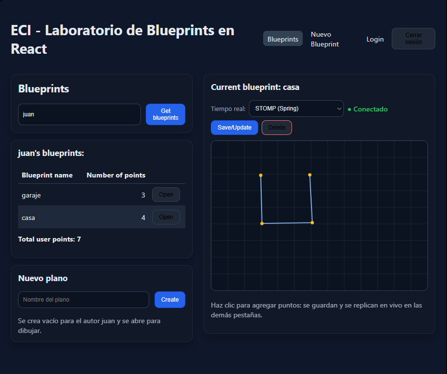

**3.2 Create — plano nuevo creado y abierto**

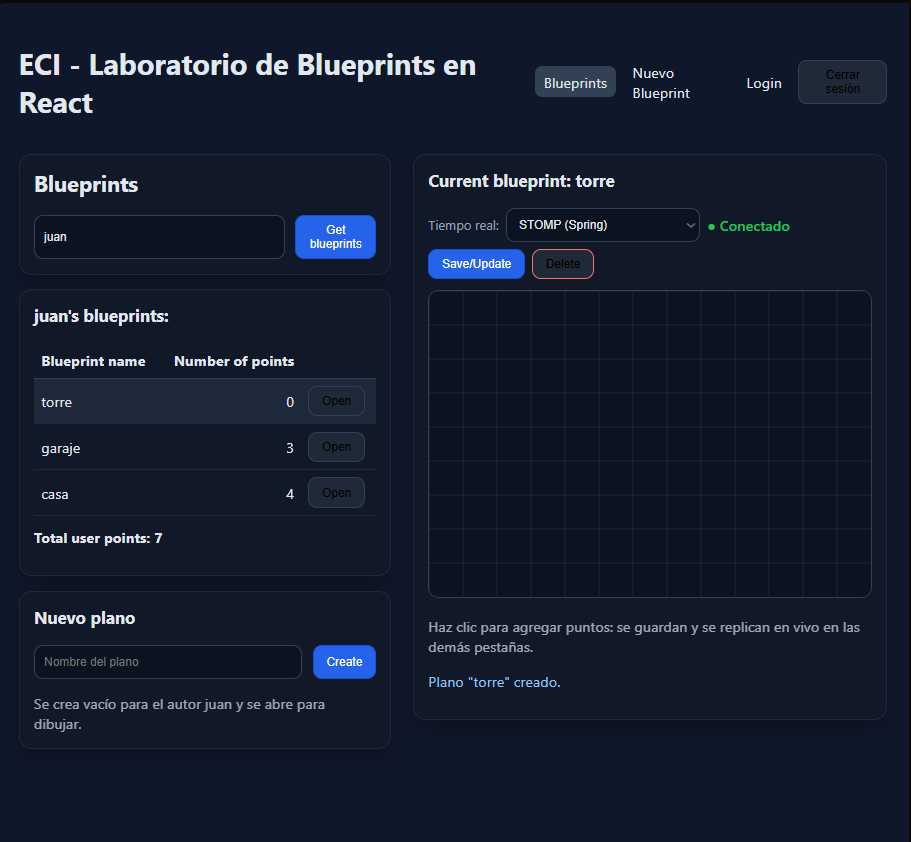

**3.3 Dibujo por clic con STOMP conectado**

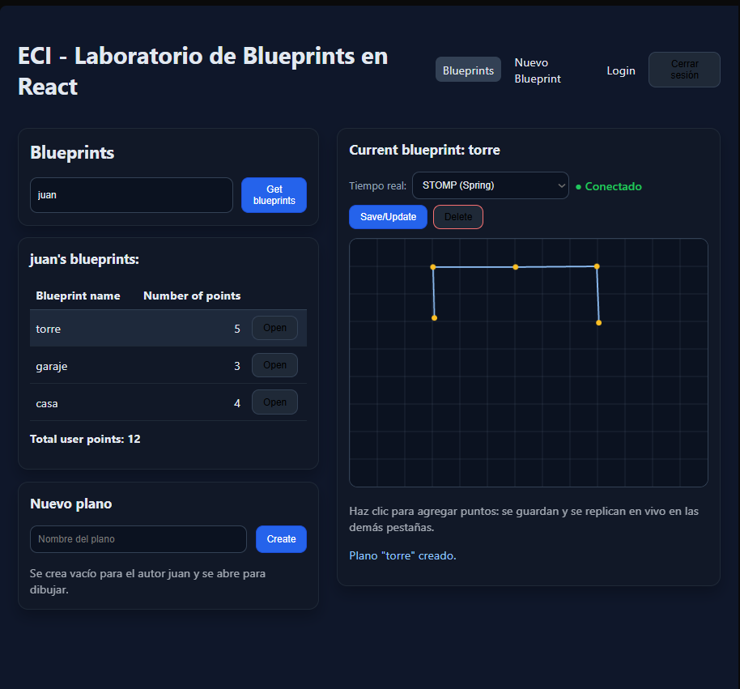

**3.4 Modo "Ninguno": puntos sin guardar y luego Save/Update**

| Antes de guardar | Después de Save/Update |
|---|---|
| 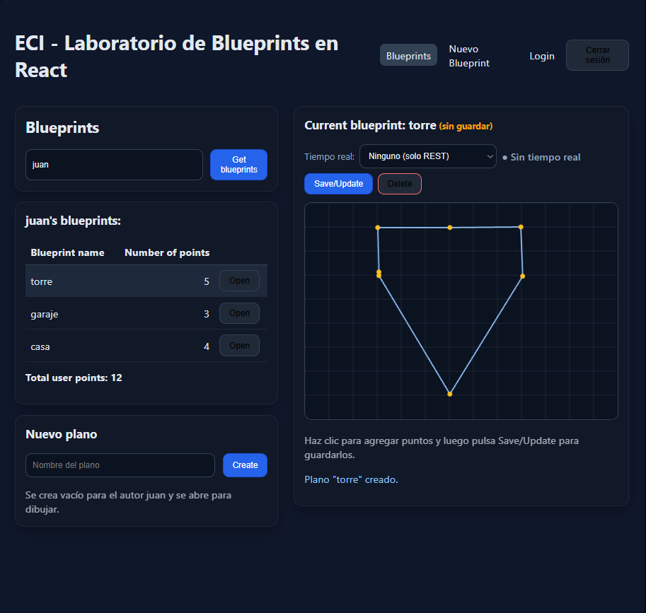 | 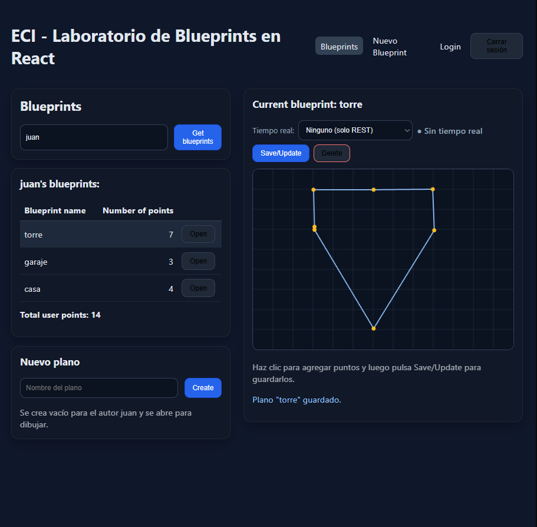 |

**3.5 Delete — el plano desaparece de la tabla**

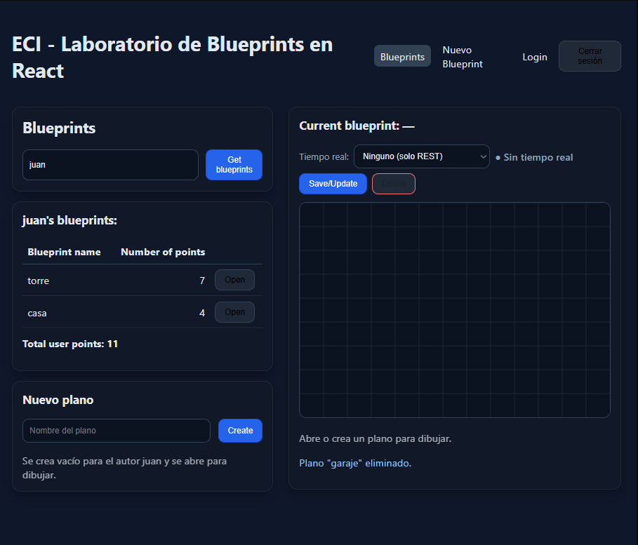

### Punto 4 — Colaboración en vivo (2 pestañas)

🎥 **Video:** https://youtu.be/TR9pVj9SwFE

El video muestra, en orden:

1. **Conexión en tiempo real:** dos ventanas abiertas sobre el mismo plano, cada una con el indicador **● Conectado**.
2. **Dibujo replicado en vivo:** al hacer clic en el canvas de una ventana, el punto aparece inmediatamente en la otra.
3. **Aislamiento por plano:** al cambiar una de las ventanas a un plano distinto, los puntos dibujados en una ya no se reflejan en la otra, confirmando que cada plano es un canal independiente.
4. **Consistencia de datos:** al volver ambas ventanas al mismo plano y refrescar, las dos muestran exactamente la misma cantidad de puntos.
5. **Eliminación sincronizada:** al eliminar el plano desde una ventana y recargar la otra, el plano eliminado ya no aparece.
6. **Logs del backend:** se muestran los logs `[RT]` del servidor registrando las conexiones y los eventos de dibujo en tiempo real.
